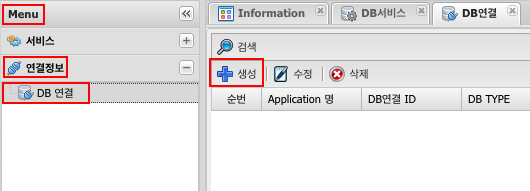

# DB 연결

## 1. DB 연결 이란
### 1.1. 정의
DB Service, Schedule Service 등 서비스에서 사용될 DBMS 연결 정보 생성

### 1.2. 지원하는 DBMS
- [x] Oracle
- [x] MSSql
- [x] MYSql
- [x] MariaDB
- [x] SQLIte
- [ ] PostgreSQL
- [ ] CUBRID

## 2. 사용법
### 2.1. 생성
Menu > 연결정보 > DB 연결 > 생성  

### 2.2. 속성
| 입력값 | 설명 |
|:---:|:---:|
| DB 연결 ID | 고유식별자, DB Service등에서 DB 연결 ID 선택시 사용된다. 중복불가능, 20자 이내, 영어숫자 underscore(_)사용 가능 |
| DB TYPE | 연결할 대상의 DBMS선택 |
| IP | 연결할 DBMS의 IP |
| 포트 | 연결할 DBMS가 사용중인 Port(숫자) |
| DB명칭(SID) | MSSQL, MySQL, MariaDB 에서는 Database명, ORACLE sid |
| 최대활성 | Connection Pool 갯수 |
| 최대유휴 | Connection Pool 안의 유휴 갯수 설정 |
| 사용자 ID | Database 연결시 사용되는 사용자 ID |
| 비밀번호 | Database 연결시 사용되는 사용자의 비밀번호 |
| 그룹 | 작업자가 구분하기 위해서 사용 (Menu > 관리도구 > 서비스 그룹 에서 생성가능) |
| isolation level | 트랜잭션에서 일관성이 없는 데이터를 허용하는 수준 |
| 병렬 Database Pool Options(Slave) | slave로 구성된 database 정보 기입란(복수개 입력가능) |
