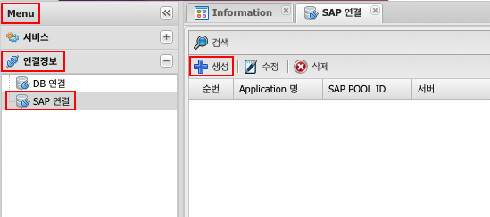

# DB 연결

## 1. SAP 연결 이란
### 1.1. 정의
SAP Service 서비스에서 사용될 SAP 연결 정보 생성

---
## 2. 사용법
### 2.1. 생성 SAP 연결
menu > 연결정보 > SAP 연결 > 생성

### 2.2. SAP 연결 속성

| 이름 | 설명 |
|:---:|---|
| POOL ID | SAP POOL ID, SAP Service에서 SAP 연결 ID에 사용 |
| POOL Size | POOL Size 설정 |
| 서버 | 서버 |
| 클라이언트 | 클라이언트 |
| 언어 | 언어 |
| 시스템 번호 | 시스템 번호 | 
| 레파지토리 | 레파지토리 | 
| R3 명칭 | R3 명칭 |
| 사용자 ID | SAP 사용자 ID |
| 비밀번호 | 사용자 ID 의 비밀번호 |
| SAP연결 설명 | 연결에대한 설명 |
| 그룹 | 작업자가 구분하기 위해 사용 |

