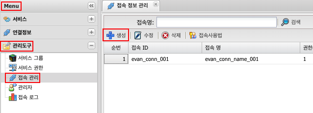
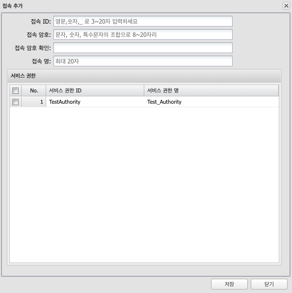

# 접속 관리
## 1. 접속 관리란
서비스중 __인증체크: 사용__ 하는 서비스에 대 서비스 권한을 만들었다면 외부에서 접근이 가능하게 TOKEN을 발급 받기위한 접속 관리 생성

## 2. 사용법
### 2.1 생성
Menu > 관리도구 > 접속 관리 > 생성



### 2.2 속성

| 구분 | 설명 |
|:---:|---|
| 접속 ID | TOKEN 발급시에 필요한 접속 ID |
| 접속 암호 | 암호 |
| 접속 암호 확인 | 암호 확인 |
| 접속 명 | 작업자가 구분하기 위해 사용 |
| 서비스 권한 | 생성한 서비스권한들 중 해당 접속 ID로 사용할 서비스 권한 선택 (복수개 선택가능) |



### 2.3 TOKEN 발급 방법

Token 발급 URL: {host}/accessProc.do

#### 2.3.1 요청

ADD_MAP 설명  
1. 선택사항 이고 세션변수 처럼 사용 가능 String만 가능  
2. 최대 5개 KEY-VALUE만 허용 5개 초과 저장되지 않는다.  

- Body Data(application/json)

```json
{
"ACCESS_ID" :"접속ID",
"PASSWORD"  :"암호",
"ADD_MAP"   : {"UID":"ACL01","UNAME":"ACL_NAME"}
}
```
- Body Data(form-data)

```json
data={
"ACCESS_ID" :"접속ID",
"PASSWORD"  :"암호",
"ADD_MAP"   : {"UID":"ACL01","UNAME":"ACL_NAME"}
}
```

> 사용 예) DB Service 쿼리문  
SELECT  NAME  
FROM    TB_USER  
WHERE   ID={'$UID$'}

> ADD_MAP의 UID(ACL01)값이 입력된다.  
쿼리문에 세션변수를 사용하듯이 사용 가능

#### 2.3.1 응답
Content-Type : application/json

- 성공

httpclient 사용시 _JWT_,_JWT_TIME_를 Request의 Cookie에 담아서 호출하면 인증을 통과 합니다.

```json
{
    sucess:true,
    message:"",
    _JWT_:"암호화된.문자열.입니다"
    _JWT_TIME_:"_JWT_의 시간"
}
```

- 실패

```json
{
    sucess:false,
    message:"Access Fail(invalid access id or password)"
}
```