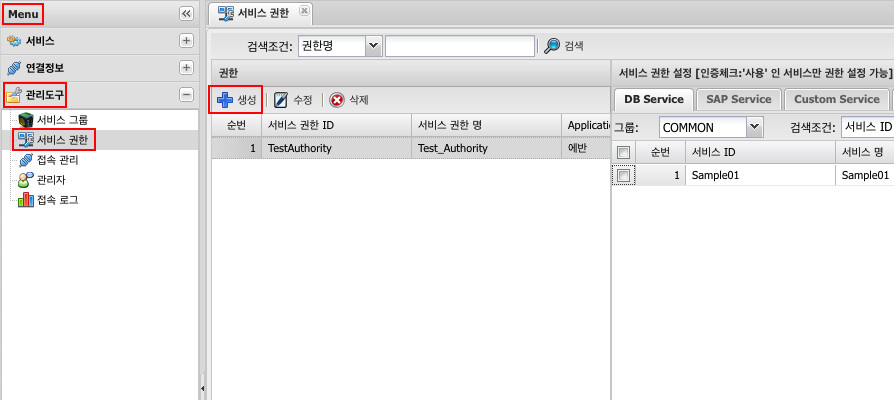
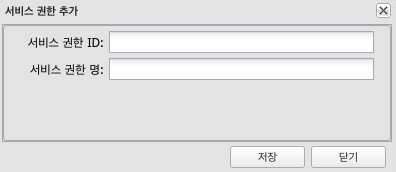
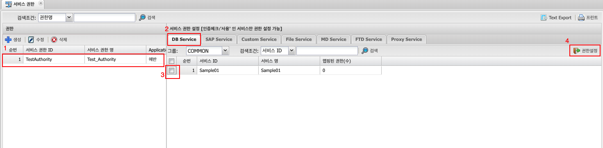

# 서비스 권한
## 1. 서비스 권한이란
만들어진 서비스들 중 __인증체크: 사용__ 인 서비스에 대해 접근 권한 설정

## 2. 사용법
### 2.1 생성
Menu > 관리도구 > 서비스권한 > 생성

### 2.2 속성

| 구분 | 설명 |
|:---:|---|
| 서비스 권한 ID | 25자 이내 영문,숫자,_ |
| 서비스 권한 명 | 작업자가 구분하기 위해 사용 |

### 2.3 권한에 서비스 설정

아래 그림의 순서대로  
1. 만들어진 권한 선택  
2. 원하는 서비스 선택(DB, Custom, File, 등등의 원하는 서비스메뉴 탭 선택)  
3. 서비스 메뉴중 만들어진 서비스 선택 (해당 권한에 설정할 서비스 체크박스 선택)  
4. 선택후 권한 설정  

