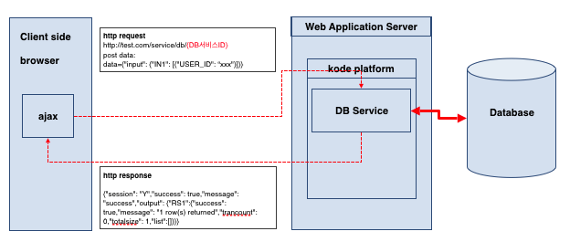
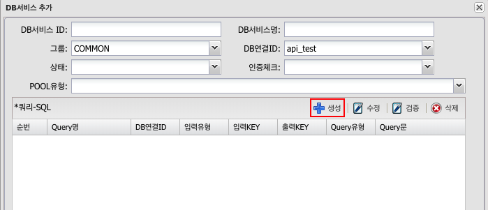
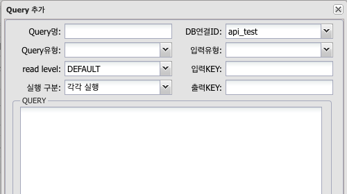
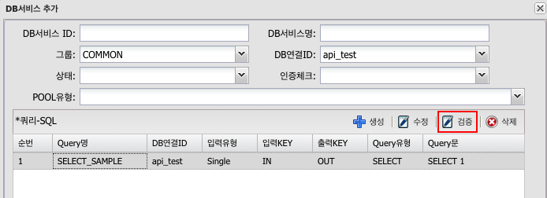
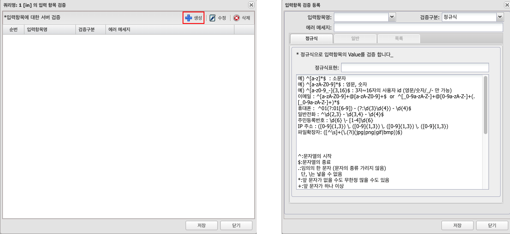
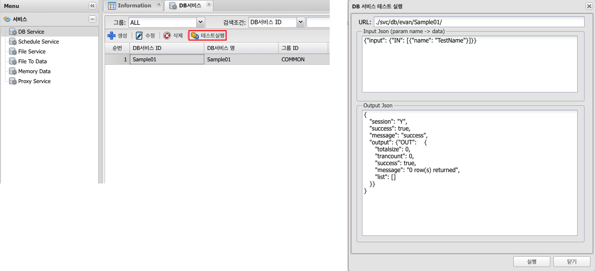

# DB Service

## 1. DB Service 란
### 1.1 정의
기본적으로 SELECT, INSERT, UPDATE, DELETE 쿼리를 수행한다.  
전통적인 MVC패턴의 controller 와 model 부분을 담당한다.

### 1.2 구조
DB Service(쿼리)를 작성(등록)하면 Web상에 호출가능한 서비스(POST) 로 생성된다.  
일반적으로 ajax를 통해 json을 주고받는다.



---
## 2. 사용법
### 2.1 생성
Menu > 서비스 > DB Service > 생성  


### 2.2 속성
| 구분 | 설명 |
|:---:|---|
| DB 서비스 ID | 고유한 ID (중복불가 , 알파벳 숫자 , 특수문자('_')  30자이내) {host}/svc/db/{userName}/{DB서비스ID} 로 호출되어지는 서비스로 생성된다. |
| DB 서비스명 | 이름, 혹은 설명을 입력, 작업자가 구분하기 위해 사용 |
| 그룹 | 작업자가 구분하기 위해 사용 |
| DB 연결 ID | DB서비스에서 기본적으로 사용할 DB POOl(connection) menu > 연결정보 > DB연결 에서 생성된 pool |
| 상태 | 활성/비활성, 비활성일 경우 서비스가 제한된다. |
| 인증체크 | 사용/미사용, 미사용이면 누구나 사용 가능 하고, 발급된 Token이 유효한 경우나 로그인 세션이 있는 경우만 사용 할지를 정의한다.  |
| POOL 유형 | 전체(선택한 DB연결ID 하나만 사용 TRANSACTION가능): 모든 쿼리는 '4. DB연결 ID'에서 선택한 하나의 DB POOL을 사용한다. <br/> 개별(각각의 QUERY의 DB연결ID를 사용 TRANSACTION불가) : 쿼리별로 각각 DB POOL을 지정하여 사용 한다. |
| 쿼리 생성 | [2.3 쿼리생성 참조](#23-쿼리-생성) |

### 2.3 쿼리 생성
DB 서비스 추가 창 > 생성
실제 쿼리를 작성한다,  쿼리를 여러개 작성 할 수 있다.  
한번의 서비스 호출로 여러개의 select결과 혹은 여러 CRUD를 실행 할 수 있다.  
Database작업은 쿼리의 실행 순서도 중요하므로 순번을 이동 할 수 있다. (마우스 드래그앤드롭)  



| 구분 | 설명 |
|:---:|---|
| Query명 | 작업자 쿼리를 구분하기 위해 사용, 예)LIST, ADD, MOD, DEL 등 |
| DB 연결 ID | 해당 쿼리가 사용할 DB Pool '7. POOL유형'에서 '개별'로 선택한 경우만 작동된다.<br />'전체'일 경우는 '4. DB연결 ID'에서 선택된 pool을 사용 한다. |
| Query 유형 | Single : 단일 값(record)만 Array의 첫번째 record 사용한다.<br />예) Query유형이 SELECT 인경우는 필수, INSERT UPDATE DELETE인 경우도 1개만 사용할 경우<br />Array  : Array 전체를 사용<br />예) INSERT, UPDATE, DELETE인 경우 복수의 값을 입력할 경우 사용 |
| 입력 유형 | SELECT,INSERT,UPDATE,DELETE 를 확실히 구분 한다.<br />Query 유형에 따라 결과값을 다르게 받기 때문에 정확히 해야 한다.<br />SELECT는 ResultSet을 , 나머지는 int 혹은 int[]로 결과를 받는다. |
| read level | 'Query 유형'이 SELECT 인 경우만 해당함 transaction isolation level을 의미한다.<br />DBMS별로 확인 필요 READ_UNCOMMITED을 지원 안 하는 DBMS도 있음 (oracle)<br />예) INSERT가 계속 발생하는 테이블을 읽을 수 없는 경우 READ_UNCOMMITED로 설정하면 읽을 수 있다.<br />권장하지는 않으나 반드시 필요한 경우 |
| 실행 구분 | 'Query 유형'이 INSERT UPDATE DELETE 인 경우만 해당함<br />각각실행 : 입력값 별로 executeUpdate 실행<br />Batch 시행 : executeBatch 실행 |
| 입력 Key | 쿼리가 입력받은 json에서 입력부분 Array의 KEY값을 정의 한다.<br />예) 입력 KEY : IN1<br />json data를  아래와 같은 구조로 입력한다.<br /><pre lang="json">{"input": {"IN1": [{"USER_LOGIN": ""}]}}</pre> |
| 출력 Key | 쿼리 수행 후 결과값의 KEY값을 정의 한다. |
| 쿼리 작성 | 실제 수행될 쿼리를 작성한다.<br />[입력파라미터 설명 2.3.1 쿼리 작성 참조](#231-쿼리-작성) |

#### 2.3.1 쿼리 작성
- 일반변수  
PreparedStatemnet의 ? 에 입력된다. mybatis의 #{변수명} 과 유사  
사용법 : {'#변수명#'}  
WHERE절 부분에는 반드시 일반변수를 권장한다.

- 치환변수  
입력값을 해당부분에 치환(replace) 한다.  mybatis의 ${변수명} 과 유사  
ORDER BY의 컬럼명이나 혹은 ASC/DESC 같은 일반변수로 입력이 안되는  
경우에만 사용 한다.  
보안상 위험 하므로 권장하지는 않으나 반드시 필요한 경우  
사용하는 경우는 '검증'을 통해 보안상 위험을 제거하기를 권장한다.  
사용법 : {'@변수명@'} 

- session변수  
session변수를 DB Service에서 사용 할 수 있도록 한다.  
session attribute의 값을 쿼리 실행시 입력하므로  
클라이언트에서 값을 직접 입력 할 필요가 없다  
제약사항은 session attribute에  key:String , value:String 인 값만 사용 한다.  
사용법 : {'$세션변수명$'}

- 쿼리 작성 예시 SELECT SAMPLE (입력 KEY : IN1)
```sql
SELECT   a.USER_ID
        ,a.NAME
        ,a.PHONE
        ,a.REG_DATE
FROM    TB_USER a
WHERE   a.USER_ID={'$USER_ID$'}   /*세션변수*/
AND      a.NAME LIKE {'#NAME#'}   /*일반변수*/
ORDER BY {'@COL_NAME@'}           /*치환변수*/
```

- 서비스 호출할때 입력 값 작성 예시
```json         
{ "input": {
    "IN1": [{
        "NAME": "변수%"               /*일반변수*/
        ,"COL_NAME": "a.REG_DATE"    /*치환변수*/
     }]
   }
}
```

### 2.4 검증
입력값에 대한 server side 검증  
DB Service 입력 값에 대한 검증(validation)을 한다.  
쿼리를 선택하고 '검증' 버튼을 클릭한다.  


#### 2.4.1 검증 생성/수정
- 입력항목명
입력항목을 선택한다. 일반변수, 치환변수의 목록이 나타난다, 세션변수는 제외  
'query-sample001' 기준으로 NAME , COL_NAME
- 검증구분

| 구분 | 내용 |
|:---:|---|
| 정규식 | 입력값을 정규식으로 검증한다. |
| 일반 | 항목유형(변수타입,숫자,문자 제한등) , 최소길이(크기) , 최대길이(크기) 를 검증 |
| 목록 | 목록에 있는 값인지만 판단, ORDER BY의 정렬부분의 치환변수 값을 검증 할때는 ‘ASC’와’DESC’를 목록에 입력 |

- 에러메세지
검증실패시 client에 보내줄 에러메세지


### 2.5 테스트
DB Service를 직접 실행 해보는 기능  
쿼리의 입력변수에 맞게 'Input Json' Textarea에 json문법이 자동으로 작성된다. (값만 직접 입력해서 테스트 하면 됨)  
클라이언트 사이드에서는 테스트의 json sample를 확인하고 입력 테스트 하고 결과값을 확인 하여 개발 하도록 한다.  
POST만 지원 하고 클라이언트 사이드에서 ajax로 호출 할 때 변수 “data”에 json 을 넣어 처리해야 한다.



---
## 3. Dynamic Query
### 3.1 Javascript
예약된 객체

| 구분 | 타입 | 설명 |
|:---:|---|---|
| data |  Object | input 변수 담은 객체 |
| session | Object | session 변수 담은 객체 |
| out | StringBuilder | (append(obj),toString() 만 있음)  output 객체 |

#### 3.1.1 입력변수의 유무로 조건 추가 Query

Query
```sql
SELECT  A.USER_ID
,   A.USER_NAME
FROM    TB_USER A
WHERE   1=1
<!
    if(data.USER_ID !== undefined){
!>
    AND A.USER_ID = {'#USER_ID#'}
<!
    }
!>
```

Input Data - USER_ID가 test인 목록만 SELECT
```json
{"input": {
    "IN1": [
        {"USER_ID":"test"}
    ]
}}
```

Input Data - TB_USER 전체가 SELECT
```json
{"input": {
    "IN1": [
        {}
    ]
}}
```

#### 3.1.2 WHERE절 IN 생성 Query

Query
```sql
SELECT   A.USER_ID
,            A.USER_NAME
FROM    TB_USER A
WHERE   1=1
<!
   if(data.USER_IDS!==undefined){
      if(data.USER_IDS.length>0){
         var strIns="";
         for(var i=0;i<data.USER_IDS.length;i++){
            var json = data.USER_IDS[i];
            if(i==0){
               strIns+="'"+json.USER_ID+"'";
            }else{
               strIns+=",'"+json.USER_ID+"'";
            }
         }
         strIns = "("+strIns+")";
         out.append("AND A.USER_ID IN " + strIns + " ");
      }
   }
!>
```

Input Data  
```json
{"input": {"IN1": [
         {
            "USER_IDS":[{"USER_ID":"admin"},{"USER_ID":"test"}]
         }
      ]
}}
```


### 3.2 JAVA
예약된 객체

| 구분 | 타입 | 설명 |
|:---:|---|---|
| data |  net.sf.json.JSONObject | input 변수 담은 JSON객체 |
| session | HashMap<String,String> | session 변수 담은 객체 |
| out | StringBuilder | output 객체 |

#### 3.2.1 입력변수의 유무로 조건 추가 Query

Query
```sql
SELECT   A.USER_ID
,            A.USER_NAME
FROM   TB_USER A
WHERE   1=1
<%
   if(data.has("USER_ID")){
%>
   AND   A.USER_ID = {'#USER_ID#'}
<%
   }
%>
```

Input Data - USER_ID가 test인 목록만 SELECT
```json
{"input": {
    "IN1": [
        {"USER_ID":"test"}
    ]
}}
```

Input Data - TB_USER 전체가 SELECT
```json
{"input": {
    "IN1": [
        {}
    ]
}}
```

#### 3.2.2 WHERE절 IN 생성 Query

Query
```sql
SELECT   A.USER_ID
,            A.USER_NAME
FROM   TB_USER A
WHERE   1=1
<%
   if(data.has("USER_IDS")){
      if(data.getJSONArray("USER_IDS").size()>0){
         String strIns="";
         for(int i=0;i<data.getJSONArray("USER_IDS").size();i++){
            JSONObject json = data.getJSONArray("USER_IDS").getJSONObject(i);
            if(i==0){
               strIns+="'"+json.getString("USER_ID")+"'";
            }else{
               strIns+=",'"+json.getString("USER_ID")+"'";
            }
         }
         strIns = "("+strIns+")";
         out.append("AND   A.USER_ID IN " + strIns + " \n");
      }
   }
%>
```

Input Data
```json
{"input": {
    "IN1": [
        {
            "USER_IDS":[{"USER_ID":"admin"},{"USER_ID":"test"}]
        }
    ]
}}
```

## 4. Tip

### 4.1 input Key 중복사용
DB Service는 여러개의 쿼리를 한번에 실행 할 수 있다.

> 1번 쿼리: SELECT * FROM TB_USER WHERE USER_ID={'#USER_ID#'};  
2번 쿼리: SELECT * FROM TB_USER_HISTORY WHERE USER_ID={'#USER_ID#'};

여기서 입력변수 USER_ID가 같은 값이라면 각각 쿼리의 Input Key를 다르게 하지 않고 1개로 같이 사용한다.

1번 쿼리 input key: IN1 , output key: RS1  
2번 쿼리 input key: IN2 , output key: RS2
 
input json 구조
```json
{"input": {
    "IN1": [{"USER_ID": ""}]
    ,"IN2": [{"USER_ID": ""}]
}}
```

1번 쿼리 input key: IN1 , output key: RS1  
2번 쿼리 input key: IN1 , output key: RS2
 
input json 구조
```json
{"input": {
    "IN1": [{"USER_ID": ""}]
}}
```


### 4.2 output key 를 input key로 사용
SELECT 한 값을 INSERT 나 UPDATE,DELETE 하고 싶은 경우 혹은 SELECT 한 값으로  
다른 SELECT를 하고 싶은 경우  
물론 같은 DB pool이면 이러한 일을 한다는 건 무의미 하다.  
각각 쿼리의 DB pool이 다른 경우에 사용한다.  
예를 들어 oracle에서 select해서 mssql에 insert 하고 싶은 경우에 해당한다.

>1번 쿼리: SELECT A.USER_ID as UID FROM oracle.TB_USER A WHERE A.USER_ID={'#USER_ID#’};  
2번 쿼리: INSERT INTO mssql.TB_USER_HISTORY(UID) VALUES ({'#UID#'});

1번 쿼리 input key: IN1 , output key: RS1  
2번 쿼리 input key: RS1 , output key: RS2

input json 구조
```json
{"input": {
    "IN1": [{"USER_ID": ""}]
}}
```

이렇게 하면 1번 쿼리의 output key RS1에 있는 list array의 값을 2번 쿼리에 input key로 사용 한다.  

물론 이런 경우 원하는 것은 결국 mssql의 INSERT 이지만 결과값 RS1의 list가 리턴 된다.  
만약 1번 쿼리의 값을 받기 싫다면 'TMP_' 를 key앞에 넣으면 list array를 비워서 보낸다.  

1번 쿼리 input key: IN1 , output key: TMP_RS1  
2번 쿼리 input key: TMP_RS1 , output key: RS2
