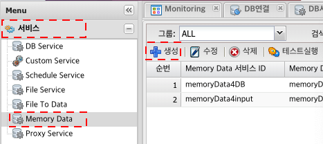
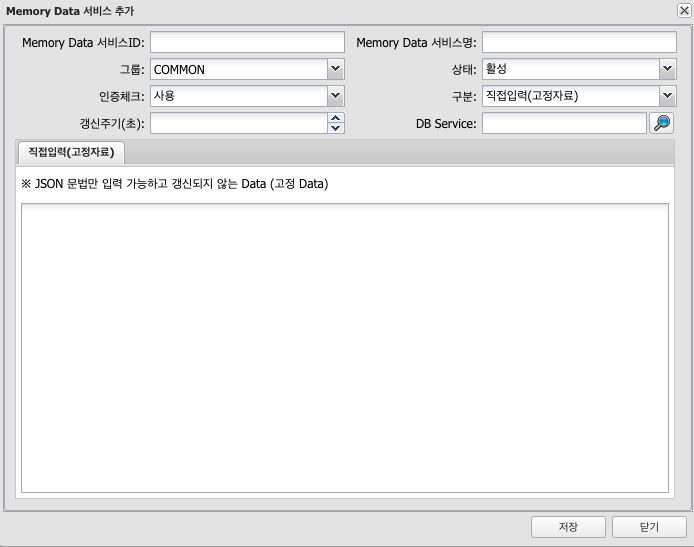
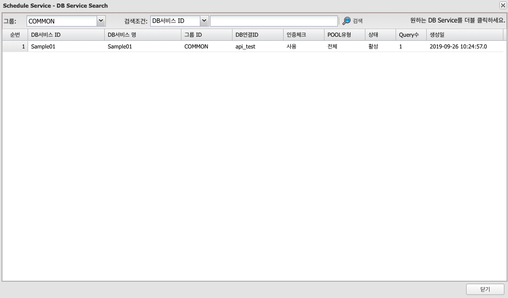
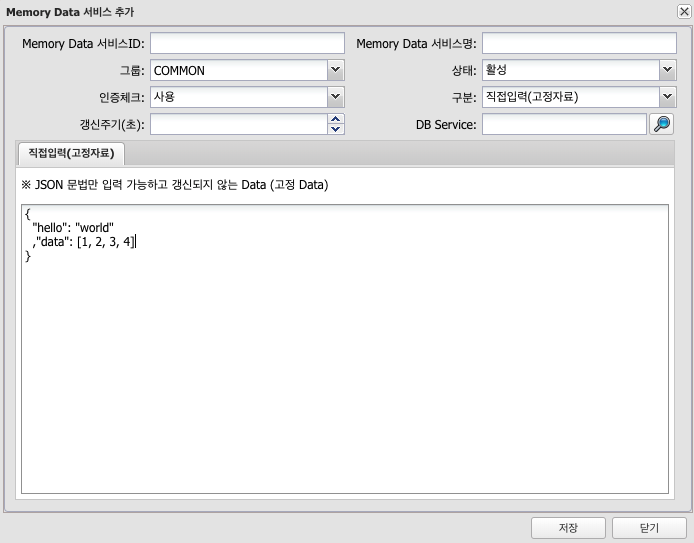
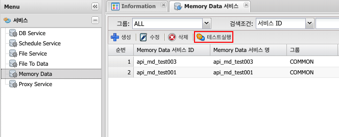
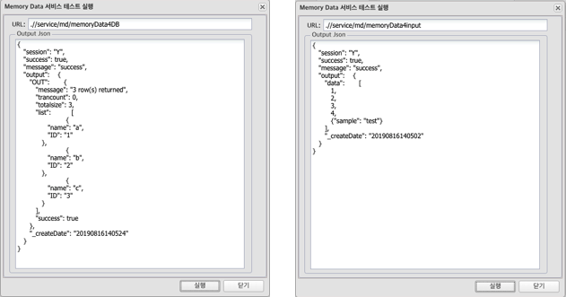

# Memory Service
## 1. Memory Service 란
### 1.1 정의
DB 입력 없이 메모리에 데이터를 올려 빠르게 조회하는 기능

---
## 2. 사용법
### 2.1 생성
menu > 서비스 > Memory Data > 생성

### 2.2 속성

| 구분 | 설명 |
|:---:|---|
| Memory Data 서비스 ID | 고유한 ID(중복 불가, 영어 숫자 underscore('_') 5자 이상 50자 이내 {host}/svc/md/{userName}{Memory Data서비스ID} 로 호출되어지는 서비스로 생성된다 |
| Memory Data 서비스명 | 이름, 혹은 설명입력, 작업자가 구분하기 위해 사용 |
| 그룹 | 작업자가 구분하기 위해 사용 |
| 상태 | 서비스 사용 상태 구분, 활성 / 비활성 선택하여 사용 선택가능 |
| 인증체크 | 발급된 Token을 사용하여 서비스 사용시 인증 체크 사용 여부 |
| 구분 | 데이터 직접입력, DB Service 중 선택 가능 |
| 갱신주기(초) | 구분을 DB Service 선택시 데이터 갱신 주기 |
| DB Service | 구분을 DB Service 선택시 사용할 DB 서비스 선택 |

#### 2.2.1 속성 DB Service

속성으로 DB Service(Read Only) 선택시 미리 만들어 놓은 DB Service 항목들중 선택 가능

#### 2.2.2 속성 직접입력

JSON Format의 문자열 입력가능

### 2.3 테스트

생성된 Memory Data Item 선택 > 테스트실행

좌측으로부터 구분-DB Service 선택, 구분-직접입력 선택 테스트 결과

