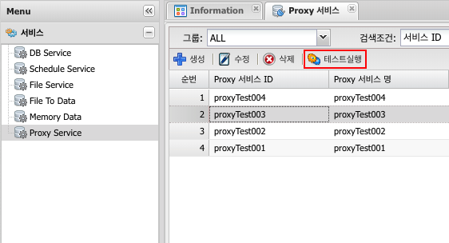

# Proxy Service
## 1. Proxy Service 란
### 1.1 정의
Proxy Service란 대리라는 의미로 직접 통신할수 없는 두점 사이에서 통신을 할 경우 그 사이에 있는 중계기로서 대리로 통신을 수행하는 기능을 Proxy라 한다.

## 2. 사용법
### 2.1 생성
menu > 서비스 > File To Data > 생성

### 2.2 속성

| 구분 | 설명 |
|:---:|---|
| Proxy 서비스 ID | 고유한 ID(중복 불가, 영어 숫자 underscore('_') 5자 이상 50자 이내 {host}/svc/prx/{userName}{Proxy서비스ID} 로 호출되어지는 서비스로 생성된다 |
| Proxy 서비스명 | 이름, 혹은 설명입력, 작업자가 구분하기 위해 사용 |
| 그룹 | 작업자가 구분하기 위해 사용 |
| 상태 | 서비스 사용 상태 구분, 활성 / 비활성 선택하여 사용 선택가능 |
| 인증체크 | 발급된 Token을 사용하여 서비스 사용시 인증 체크 사용 여부 |
| 로그(DB Insert) | proxy 서비스 사용 내역을 DB에 입력 사용 여부 |
| Forward IP | Client IP |
| Preserve Host | Host 헤더를 현재 사용자가 요청한 서버 host로 지정 |
| Preserve Cookies | Cookie 헤더를 현재 사용자가 요청한 서버 cookie로 지정 |
| Handle Redirect | [참고](https://hc.apache.org/httpcomponents-client-ga/httpclient/apidocs/org/apache/http/client/config/RequestConfig.Builder.html#setRedirectsEnabled(boolean)){:target="_blank"} |
| Socker Timeout(ms) | Socket 연결 제한시간 |
| Read Timeout(ms) | 백엔드 서버로부터 데이터를 읽을 때의 제한시간 |
| Request Timeout(ms) | 백엔드 서버로 데이터를 전송할 때의 제한시간 |
| Max Connections | 최대 연결 갯수 |
| Load Balancing | 로드밸런싱 알고리즘 선택(round-robin, hash, least) |
| Target Path | Add Target Path를 선택하여 연결대상 설정가능(복수개 가능) |

#### 2.2.1 Load Balancing

| 구분 | 설명 |
|:---:|---|
| Round-robin | 호출 대상 서버가 5개이고 각각의 고유 번호를 1~5번일때 1번부터 5번까지 순차적 호출 기법 |
| hash | 사용자 ip를 hasing하여 분배하는데, 사용자는 항상 같은 서버로 연결을 보장하는 기법 |
| least | 호출 대상서버가 복수개일때 연결 개수가 가장 적은 서버를 선택하여 호출 하는 기법 |

### 2.3 테스트

생성된 Proxy Service Item 선택 > 테스트실행

테스트 결과

