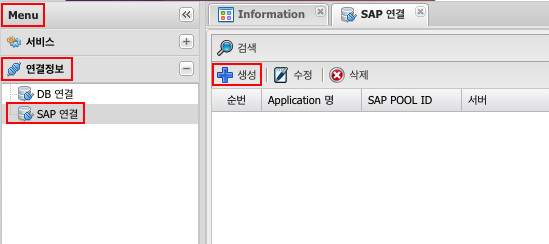
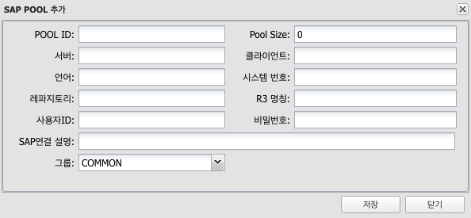

# SAP Service
## 1.. SAP Service 란
### 1.1. 정의
특정 양식의 파일을 업로드하면 Database에 Table로 삽입하는 기능

---
## 2.. 사용법
### 2.1. 생성 SAP 연결
menu > 연결정보 > SAP 연결 > 생성

### 2.2. SAP 연결 속성

| 이름 | 설명 |
|:---:|---|
| POOL ID | SAP POOL ID, SAP Service에서 SAP 연결 ID에 사용 |
| POOL Size | POOL Size 설정 |
| 서버 | 서버 |
| 클라이언트 | 클라이언트 |
| 언어 | 언어 |
| 시스템 번호 | 시스템 번호 |
| 레파지토리 | 레파지토리 |
| R3 명칭 | R3 명칭 |
| 사용자 ID | SAP 사용자 ID |
| 비밀번호 | 사용자 ID 의 비밀번호 |
| SAP연결 설명 | 연결에대한 설명 |
| 그룹 | 작업자가 구분하기 위해 사용 |

### 2.3. SAP 서비스 생성
menu > 서비스 > SAP Service > 생성

#### 2.3.1. SAP 함수(RFC) 검색
함수명란에 함수기입 후 검색하여 나온 결과물 중 사용 할 아이템 선택(더블클릭)

#### 2.3.2 검색된 함수(RFC) 구조 확인
상단의 맵핑정보 클릭 후 함수구조 확인 가능

### 2.4. SAP 서비스 속성

| 이름 | 설명 |
|:---:|---|

### 2.3. 테스트

테스트 할 아이템 선택후 테스트실행 클릭

SAP RFC 입력 구조가 자동으로 생성

SAP RFC 입력 구조란에 값 입력

실행버튼 클릭 후 결과 값 확인

