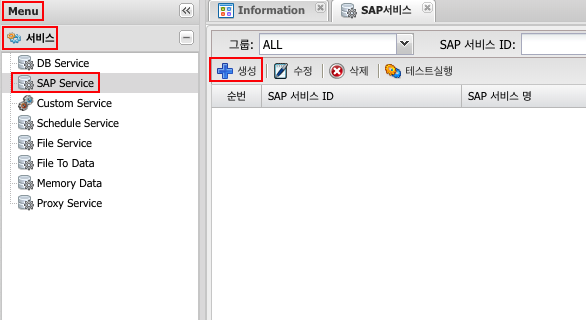
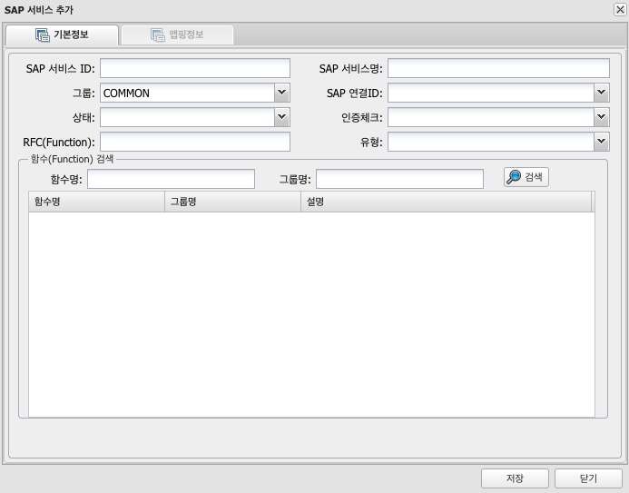
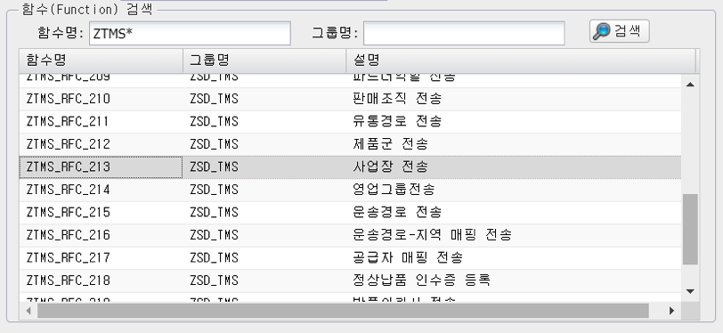
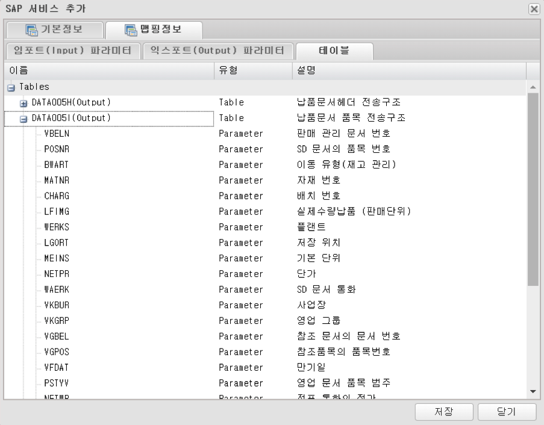
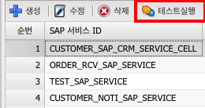
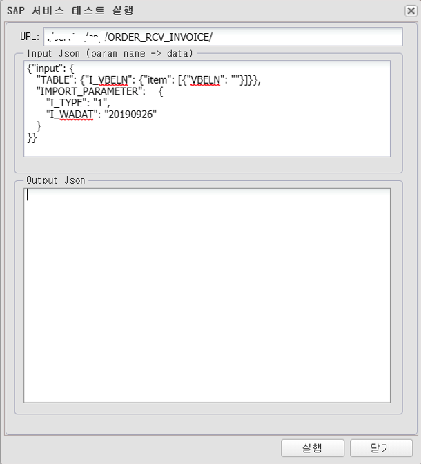
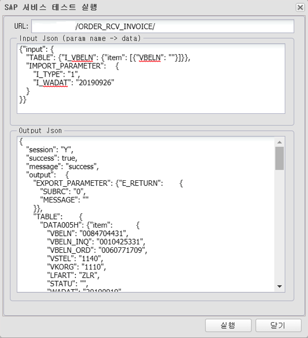

# SAP Service
## 1. SAP Service 란
### 1.1. 정의
특정 양식의 파일을 업로드하면 Database에 Table로 삽입하는 기능

---
## 2. 사용법
### 2.1. SAP 서비스 생성
menu > 서비스 > SAP Service > 생성

### 2.1.1. SAP 서비스 속성

| 이름 | 설명 |
|:---:|---|
| SAP 서비스 ID | 고유한 ID(중복 불가, 영어 숫자 underscore('_') 5자 이상 50자 이내 {host}/svc/sap/{userName}{SAP 서비스ID} 로 호출되어지는 서비스로 생성된다 |
| SAP 서비스명 | 이름, 혹은 설명입력, 작업자가 구분하기 위해 사용 |
| 그룹 | 작업자가 구분하기 위해 사용 |
| SAP 연결 ID | SAP서비스에서 기본적으로 사용할 SAP POOl(connection) menu > 연결정보 > SAP연결 에서 생성된 pool |
| 상태 | 서비스 사용 상태 구분, 활성 / 비활성 선택하여 사용 선택가능 |
| 인증체크 | 발급된 Token을 사용하여 서비스 사용시 인증 체크 사용 여부 |
| RFC(Function) | 검색한 함수를 선택하면 자동기입 |
| 유형 | SELECT, INSERT, UPDATE, DELETE ... |

#### 2.1.2. SAP 함수(RFC) 검색
함수명란에 함수기입 후 검색하여 나온 결과물 중 사용 할 아이템 선택(더블클릭)

#### 2.1.1 검색된 함수(RFC) 구조 확인
상단의 맵핑정보 클릭 후 함수구조 확인 가능

### 2.2. 테스트

테스트 할 아이템 선택후 테스트실행 클릭  

SAP RFC 입력 구조가 자동으로 생성  

SAP RFC 입력 구조란에 값 입력  

실행버튼 클릭 후 결과 값 확인  

